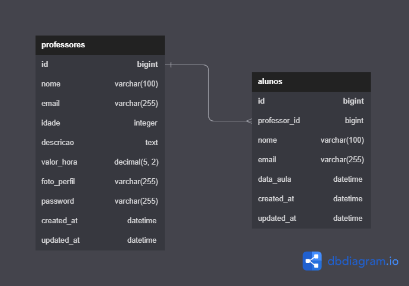

# API para gerenciamento de professores e aulas particulares

## índice

- [Descrição](#descrição)
- [Rotas](#rotas)
- [Diagrama Banco de Dados](#diagrama-banco-de-dados)

## Descrição

Uma API para gerenciar professores e aulas particulares desenvolvida com Django Rest Framework. A API deve permitir que professores se cadastrem e sejam listados, além de permitir que alunos busquem professores por descrição.

## Rotas

| Rota                                   | Método | Descrição                                         | Requer Autenticação |
| -------------------------------------- | ------ | ------------------------------------------------- | ------------------- |
| /api/professores                       | GET    | Lista os professores                              | Não                 |
| /api/professores/{professor_id}        | GET    | Detalhes do professor                             | Não                 |
| /api/professores/{professor_id}/alunos | POST   | Cadastra uma solicitação de aula                  | Não                 |
| /api/professores                       | POST   | Cadastra um professor                             | Não                 |
| /api/professores                       | PUT    | Atualiza os dados do professor logado             | Sim                 |
| /api/professores/foto                  | POST   | Atualiza a foto de um professor                   | Sim                 |
| /api/professores/alunos                | GET    | Lista as solicitações de aula do professor logado | Sim                 |
| /api/professores                       | DELETE | Exclui o professor logado                         | Sim                 |
| /api/auth/login                        | POST   | Faz login                                         | Não                 |
| /api/auth/refresh                      | POST   | Atualiza o token de acesso                        | Não                 |
| /api/auth/logout                       | POST   | Faz logout                                        | Sim                 |

## Diagrama Banco de Dados

A aplicação terá duas tabelas que irão se relacionar entre si, sendo elas a tabela `professores` e a tabela `alunos`.

*Obs.: A aplicação está configurada para executar localmente, com a configuração do S3 desativada para que o usuário possa realizar testes sem a necessidade contratar o serviço.*
